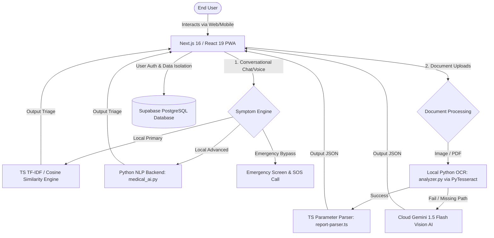

# AIHCAS — Artificial Intelligence Healthcare Assistant System

[](https://github.com/nextjs/next.js)
[](#)
[](#)

AIHCAS is a state-of-the-art, multi-modal medical companion and local-first triage application. It is engineered to provide private health assessments, voice-guided consultations, and automatic processing of medical documents (prescriptions and lab reports) using a hybrid approach: offline Python-based NLP/OCR engines paired with advanced cloud-based Large Language Models (LLMs).

---

## 🏗️ System Architecture Flow

The diagram below details the dual-intelligence model employed by AIHCAS:



---

## ⚡ Core Modules & Expected Outputs

AIHCAS consists of six tightly integrated components, each offering specialized features:

| Module | Technologies | Input Types | Expected Outputs |
| :--- | :--- | :--- | :--- |
| **🩺 Symptom Chat** | TS Cosine Similarity, Python TF-IDF, Gemini 1.5 Flash | Free text symptoms (e.g., *"severe headache and high fever"*) | Categorized triage status (Routine, Self-Care, or Doctor Consultation), detailed clinical follow-up questions, disease profiles, and self-care tips. |
| **🎙️ Voice Consultation** | Browser Web Speech API (STT + TTS) | Spoken symptoms | Real-time speech-to-text transcriptions, with the "Doctor AI Persona" replying vocally using highly natural synthetic speech. |
| **💊 Prescription Reader** | Gemini Vision AI, offline PyTesseract + Pillow, Local Drug DB | Handwritten or printed prescription images | Clean structured JSON listing: drug names, plain-language dosages (e.g., converting **TDS** to *Three times daily*), durations, drug classes, warnings, and safety instructions. |
| **📊 Lab Report Analyser** | Local grayscale contrast OCR (`analyzer.py`), `report-parser.ts` (60+ parameters) | PDFs or images of blood panels, LFTs, KFTs, Thyroid profiles | Complete dashboard benchmarking findings against standard ranges, coloring indices (Normal, High, Low), pathology summaries, and an overall **Urgency Score**. |
| **🚨 Emergency Hub** | Next.js API, Geo IP, Lucide icons | City selection dropdown | Filtered list of local Indian emergency numbers (Ambulance, Police, Disaster Management) and direct click-to-dial triggers. |
| **👤 Secure Profile & Vault** | Supabase Auth, Row-Level Security | User conditions, allergies, blood group | Tailored AI reports warning if a newly uploaded prescription interacts with registered allergies or chronic conditions. |

---

## 📋 Prerequisites & Environment Checklist

To set up and run AIHCAS locally on a Windows machine, make sure you have installed the following:

- **Node.js**: `v18.x` or higher (tested with `v20.x`)
- **Python**: `v3.9` to `v3.12`
- **Tesseract OCR Binary**: Required for local/offline document extraction.
- **Supabase Account**: A free database instance to handle authentication and secure database operations.
- **Google AI Studio Key**: API Key for Gemini model execution.

---

## 🚀 Step-by-Step Installation & Setup

### Step 1: Install Tesseract OCR on Windows
Local document parsing relies on **Tesseract OCR**. Without it, the application will automatically fall back to cloud-based Gemini (which requires an active internet connection).
1. Download the Windows installer from [UB Mannheim Tesseract Repository](https://github.com/UB-Mannheim/tesseract/wiki).
2. Install it in the default path: `C:\Program Files\Tesseract-OCR\tesseract.exe`.
3. Add the Tesseract directory to your System environment variables:
   - Search for **"Edit the system environment variables"** in the Windows search bar.
   - Click **Environment Variables**, find the **Path** variable under User/System variables, select **Edit**, click **New**, and add `C:\Program Files\Tesseract-OCR`.
   - Click OK to save all changes.

### Step 2: Configure Environment Variables
Create a file named `.env.local` in the root of the project (`/aihcas`) and populate it with your API keys:

```env
# Encryption Secret
JWT_SECRET=your_32_character_jwt_secret_key

# Google Gemini API Credentials (from https://aistudio.google.com/)
GEMINI_API_KEY=AIzaSy...your_gemini_api_key

# NextAuth Configuration
NEXTAUTH_URL=http://localhost:3000
NEXTAUTH_SECRET=your_random_nextauth_secret_hash

# Google OAuth Credentials (for social logins)
GOOGLE_CLIENT_ID=your_google_oauth_client_id.apps.googleusercontent.com
GOOGLE_CLIENT_SECRET=GOCSPX-your_google_oauth_client_secret

# Supabase API Configurations
NEXT_PUBLIC_SUPABASE_URL=https://your_project_ref.supabase.co
NEXT_PUBLIC_SUPABASE_ANON_KEY=your_supabase_anon_public_key

# Resend API (for verification emails)
RESEND_API_KEY=re_your_resend_api_key

# Alternate SMTP Gmail details (optional fallback for password reset emails)
GMAIL_USER=your_gmail@gmail.com
GMAIL_APP_PASSWORD=your_16_character_app_password
```

### Step 3: Initialize the Supabase Database
AIHCAS bypasses local file structures in favor of highly secure Supabase RLS instances:
1. Log in to the [Supabase Dashboard](https://supabase.com/).
2. Create a new project, navigate to the **SQL Editor** in the left sidebar, and select **New Query**.
3. Copy the contents of the `supabase_migration.sql` file located in the root of this project and paste it into the editor:
   ```sql
   -- Create Users Table
   CREATE TABLE IF NOT EXISTS public.aihcas_users (
     id            TEXT PRIMARY KEY,
     name          TEXT NOT NULL,
     email         TEXT UNIQUE NOT NULL,
     password_hash TEXT NOT NULL,
     provider      TEXT NOT NULL DEFAULT 'credentials',
     created_at    TIMESTAMPTZ DEFAULT NOW()
   );

   -- Create Password Reset Tokens Table
   CREATE TABLE IF NOT EXISTS public.aihcas_reset_tokens (
     id         SERIAL PRIMARY KEY,
     email      TEXT NOT NULL,
     token      TEXT NOT NULL UNIQUE,
     expires_at TIMESTAMPTZ NOT NULL,
     used       BOOLEAN DEFAULT FALSE,
     created_at TIMESTAMPTZ DEFAULT NOW()
   );

   -- Disable RLS to allow seamless serverless API integrations
   ALTER TABLE public.aihcas_users DISABLE ROW LEVEL SECURITY;
   ALTER TABLE public.aihcas_reset_tokens DISABLE ROW LEVEL SECURITY;

   -- Index for fast lookup speed
   CREATE INDEX IF NOT EXISTS aihcas_users_email_idx ON public.aihcas_users (email);
   CREATE INDEX IF NOT EXISTS aihcas_reset_tokens_token_idx ON public.aihcas_reset_tokens (token);
   ```
4. Click **Run** to execute the statements and create your PostgreSQL tables.

### Step 4: Install Dependencies
Open your PowerShell, navigate to the `/aihcas` folder, and run:

```powershell
# 1. Install Node.js frontend and backend dependencies
npm install

# 2. Install Python packages required for the local OCR / NLP engine
pip install -r requirements.txt
```
> [!NOTE]
> During installation, a `postinstall` script runs automatically to prepare local packages inside a `./python_lib` folder. This ensures the app is fully compatible with cloud containers on Render and Docker!

---

## 🏃 Step-Wise Project Execution

### A. Run Verification and API Connection Tests
Before launching the server, you can verify your Gemini API key and explore supported vision/text models:

```powershell
# Test connectivity to the Gemini models
node test_models.js

# List all models available under your Google Gemini quota
node list_models.js
```
*Expected console output:*
```text
Testing model: gemini-2.5-flash
Success for gemini-2.5-flash: Hello! How can I help you today?
```

---

### B. Verify the Local Python AI Engine from Command Line
You can test the offline NLP symptom matching and image OCR scripts directly using terminal CLI scripts:

#### 1. Test Local NLP Symptom Classifier (`medical_ai.py`):
```powershell
python src/scripts/medical_ai.py "I am experiencing severe forehead throbbing and migraine since morning"
```
*Expected Output JSON:*
```json
{"id": "headache", "score": 38}
```

If you try to pass an excluded symptom, the negation engine will automatically block it:
```powershell
python src/scripts/medical_ai.py "forehead throbbing but NO stomach pain"
```
*Expected Output JSON:*
```json
{"id": "headache", "score": 38}
```
*(Notice that stomach pain score is heavily penalized due to negation detection!)*

#### 2. Test Local OCR Image Parser (`analyzer.py`):
```powershell
python src/scripts/analyzer.py "path_to_sample_prescription_or_report.jpg" "prescription"
```
*Expected Output JSON:*
```json
{"extracted_text": "Amoxicillin 500mg\nTake 1 capsule TDS for 5 days..."}
```

---

### C. Launch the Live Development Server
Run the local next server:

```powershell
npm run dev
```

Open [http://localhost:3000](http://localhost:3000) on your web browser. You will be greeted by the glassmorphic premium homepage!

---

## 🎯 Step-by-Step Feature Walkthrough & Expected Outputs

Here is exactly how to execute and interact with the application modules through the web interface, along with their expected visual and structured outputs:

### 1. User Authentication & Profile Customization
- **How to execute:** 
  1. Click **Get Started** on the homepage to navigate to the `/auth` page.
  2. Sign up with a new account or log in.
  3. Navigate to **Health Profile** (`/dashboard/profile`).
  4. Fill in Blood Group, Allergies (e.g., *Penicillin*), and Chronic Conditions (e.g., *Asthma*). Click **Save Profile**.
- **Expected Output:**
  - Database entry is written to Supabase `aihcas_users`.
  - The UI updates immediately showing a "Profile Saved Successfully" notification.

### 2. Symptom Analysis Chat Dashboard
- **How to execute:**
  1. Navigate to the **Symptom Analysis** tab (`/dashboard/chat`).
  2. Type a symptom: *"I have had a high fever, shivering, and hot body for 2 days."*
  3. Hit Send.
- **Expected Output:**
  - The local hybrid NLP matches the symptoms against the Database, determining it corresponds to a `Fever`.
  - The AI behaves like a real doctor, sending clinical follow-up prompts: *"Are you experiencing any other symptoms like a cough, sore throat, or body aches? What is your current temperature if measured?"*
  - A beautiful visual **Triage Card** is displayed on the sidebar:
    - **Self-Care Recommended** (Green badge) if symptoms are mild.
    - **Doctor Consultation Advised** (Amber badge) if the fever is persistent.
    - **Emergency SOS Alert** (Red flashing banner) if emergency keywords like *"crushing chest pain"* or *"unable to breathe"* are entered.

### 3. Voice-Guided Assistant
- **How to execute:**
  1. Navigate to **Voice Assistant** (`/dashboard/voice`).
  2. Click the circular **Microphone Icon** (ensure you grant browser microphone permissions).
  3. Speak clearly: *"I have runny nose and severe sneezing."*
  4. Click the Microphone icon again to stop speaking.
- **Expected Output:**
  - Real-time speech-to-text transcript is written instantly into the chat text block.
  - The AI processes the symptom cluster ("Common Cold / Cough").
  - The voice assistant responds out loud: *"It sounds like you have a common cold. Keep yourself warm and hydrated..."* using the Web Speech synthesizer.

### 4. Prescription OCR & Understanding
- **How to execute:**
  1. Navigate to the **Prescription Understanding** tab (`/dashboard/prescription`).
  2. Click **Upload Image** and select a handwritten or printed prescription file (JPG/PNG).
  3. Click **Analyze Prescription**.
- **Expected Output:**
  - If Tesseract is running locally, it extracts text offline. If offline mode fails or Tesseract is missing, the system sends the image base64 to **Gemini 1.5 Flash Vision AI**.
  - A gorgeous card-based dashboard displays:
    - **Medications List**: Active drugs, strength (e.g., *Paracetamol 650mg*), and plain-language frequencies (*OD* translated to *Once daily*, *TDS* translated to *Three times daily*).
    - **Clinical Purpose**: The therapeutic action of each drug.
    - **Allergy Warnings**: A prominent red alert if any extracted drug belongs to the allergy class configured in the user's Health Profile (e.g., warning the user if the prescription contains *Amoxicillin* when their profile lists a *Penicillin* allergy).

### 5. Pathology Lab Report Interpretation
- **How to execute:**
  1. Navigate to **Report Interpretation** (`/dashboard/reports`).
  2. Upload a diagnostic blood test report (e.g., Complete Blood Count - CBC).
  3. Click **Analyze Report**.
- **Expected Output:**
  - The system pre-processes the image (converting to grayscale, enhancing contrast to `1.5x`) and runs OCR.
  - Results are rendered in a tabular grid:
    - **Hemoglobin**: `10.2 g/dL` -> **[LOW]** (colored in amber, referencing standard `11.5 - 16.5` ranges).
    - **White Blood Cells**: `14,000 /uL` -> **[HIGH]** (colored in red, highlighting potential infection).
    - An overall **Urgency Score Indicator** dials to **Soon** or **Urgent** based on the severity of out-of-range metrics.
    - A simple, plain-English summary of what the anomalies mean.

### 6. Emergency Guidance Hub
- **How to execute:**
  1. Go to **Emergency Guidance** (`/dashboard/emergency`).
  2. Search or select a city (e.g., *Mumbai*, *Bangalore*, *Delhi*).
- **Expected Output:**
  - An interactive grid pops up displaying certified direct numbers:
    - **National Health Helpline**: `104`
    - **Ambulance Service**: `102` / `108`
    - **Women Helpline**: `1091`
  - A prominent one-click **"SOS Broadcast"** button to rapidly alert pre-configured emergency contacts with one click.

---

## ☁️ Deployment Guidelines (Production on Render)

AIHCAS is production-ready for deployment on [Render](https://render.com) using the included `render.yaml` configuration:

1. **Deploying as a Web Service:**
   - Set up your Render account and connect it to your GitHub Repository.
   - Set the build environment as **Node**.
2. **System Dependencies on Render Linux Host:**
   - To make Tesseract OCR run in Render's Linux environment, add the **Tesseract APT buildpack** in your Render Dashboard Environment settings:
     ```text
     APT_PACKAGES = tesseract-ocr tesseract-ocr-eng
     ```
3. **Environment Variables:**
   - Define all `.env.local` keys under the **Environment variables** tab in the Render console.
4. **Build and Start Commands:**
   - **Build Command:** `npm run build`
   - **Start Command:** `npm start`

---

## 🛠️ Troubleshooting & Core Fixes

### Error: "tesseract is not installed or it's not in your PATH"
- **Reason:** Tesseract is not installed on the system, or Node/Python cannot locate the binary.
- **Fix:** Double-check your environment PATH variable to ensure `C:\Program Files\Tesseract-OCR` is included. After editing system variables, restart your terminal or VS Code to apply updates.

### Error: "Gemini API rate limits (HTTP 429)"
- **Reason:** Free-tier Gemini keys have strict requests-per-minute (RPM) limits.
- **Fix:** AIHCAS features an automatic failover to the local Python parser. It will automatically process inputs offline first, utilizing Gemini only when manual verification requires advanced, context-aware visual extraction.

---

*AIHCAS is developed by Sampada Kulkarni | Institution: SDMCET | Released: May 2026.*
